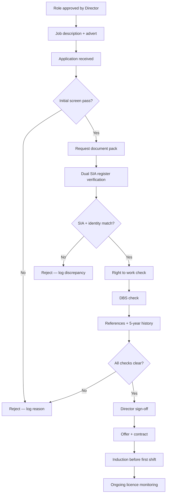

# Manager Recruitment & Vetting Protocol

> **Word documents (branded, ready to use):**
> - **Full protocol:** [`docs/Manager-Recruitment-and-Vetting-Protocol.docx`](./Manager-Recruitment-and-Vetting-Protocol.docx)
> - **Per-candidate checklist (directors):** [`docs/templates/Manager-Vetting-Record.docx`](./templates/Manager-Vetting-Record.docx)
> - **Candidate application form:** [`docs/templates/Manager-Candidate-Application-Form.docx`](./templates/Manager-Candidate-Application-Form.docx)
>
> Regenerate after edits: `npm run docs:manager-protocol`

**Document owner:** Director(s)  
**Applies to:** All manager, supervisor, and team-leader roles (employed or contracted)  
**Version:** 1.0  
**Effective date:** July 2026  
**Next review:** January 2027  

---

## 1. Purpose

This protocol is the **single reference document** for directors when hiring anyone into a management or supervisory role. It ensures every candidate is:

- **Legally entitled to work** in the UK  
- **Properly licensed** by the Security Industry Authority (SIA) where required  
- **Suitably vetted** before they hold authority over staff, clients, or operational decisions  

**Why this exists:** We previously accepted a manager who supplied an **incorrect SIA licence number**. If we had deployed them without catching the error, the company could have been **fined or prosecuted** for allowing unlicensed security work, and our insurance and ACS standing would have been at risk. This protocol prevents that.

> **Legal reminder:** Under the Private Security Industry Act 2001, you must check that anyone doing licensable security work holds a valid SIA licence. You can be **fined or imprisoned** if you pay someone to work in security without the correct licence.  
> Official register: [SIA Register of Licence Holders](https://services.sia.homeoffice.gov.uk/rolh/)  
> GOV.UK guidance: [Check security staff have a licence to work](https://www.gov.uk/check-a-private-security-licence)

---

## 2. Scope — who this covers

| Role | SIA required? | This protocol applies? |
|------|---------------|-------------------------|
| Operations / site manager supervising door or guarding staff | Yes — valid Front Line licence in relevant sector (usually Door Supervision) | **Yes — full protocol** |
| Area / regional manager with operational oversight of licensed activity | Yes — typically Non-Front Line or Front Line depending on duties | **Yes — full protocol** |
| Office-only admin with no security operational authority | Usually no SIA licence | **Partial — skip Section 5 (SIA), complete all other checks** |
| Director / company officer | Depends on duties; directors doing licensable work need valid licence | **Yes — full protocol** |

When in doubt: **treat the role as requiring SIA verification** until a director confirms otherwise in writing.

---

## 3. Roles and responsibilities

| Person | Responsibility |
|--------|------------------|
| **Director (Accountable)** | Approves final hire; signs the Vetting Record; ensures no manager starts without 100% completion |
| **Director or designated verifier** | Performs SIA register checks (dual verification); captures evidence |
| **HR / admin (if applicable)** | Collects documents, chases references, files records |
| **Candidate** | Provides true documents; attends in-person ID check |

**Golden rule:** No manager may **supervise licensed staff, represent the company on site, or make deployment decisions** until the Director has signed the completed **Manager Vetting Record** (Appendix A).

---

## 4. Process overview

**Typical timeline:** 2–4 weeks. Do **not** compress SIA or DBS steps under pressure to fill a rota.

---

## 5. SIA licence verification (critical section)

This is the most important part of the protocol. **Never rely on a photocopy, WhatsApp image, or badge photo alone.**

### 5.1 The Two-Source Verification Rule

Every candidate with an SIA licence must be verified using **two independent register searches** that must **agree with each other and with the candidate's identity**.

| Step | Action | Evidence to retain |
|------|--------|-------------------|
| **A** | Candidate provides: full legal name, date of birth, 16-digit licence number, licence sector, expiry date, and a **clear photo** of their physical SIA licence card | Copy of card (both sides if applicable) |
| **B — Search 1 (by licence number)** | Go to [SIA Register](https://services.sia.homeoffice.gov.uk/rolh/) → **Find by licence number** → enter 16 digits with no spaces | Dated screenshot showing: licence number, name, status (valid/expired/suspended), sector, expiry |
| **C — Search 2 (by identity)** | Same register → **Find by name** → surname, first name/initial, DOB (DD/MM/YYYY), role (Front Line / Non-Front Line), licence sector | Dated screenshot showing the licence number returned by this search |
| **D — Cross-match** | Compare Search 1 and Search 2: **licence numbers must be identical**. Name and expiry must match the physical card. Status must be **Valid** (not expired, suspended, or revoked) | Written note on Vetting Record: "Search 1 and Search 2 match — verified by [name] on [date]" |
| **E — Identity match** | In person or live video: compare licence card photo to candidate's face. Compare name and DOB to passport or driving licence | Signed statement: "I confirm the person present matches the SIA licence and photo ID — [Director name, date]" |
| **F — Sector match** | Confirm licence sector matches the role (e.g. Door Supervision for club/pub management) | Noted on Vetting Record |

### 5.2 Stop conditions — do not proceed if any of these occur

- Licence number on the card **does not match** the number returned by the register  
- Search by licence number returns a **different name** to the candidate  
- Search by name/DOB returns a **different licence number** to the one provided  
- Register shows **Expired**, **Suspended**, or **Revoked**  
- Candidate refuses in-person or live ID comparison  
- Candidate asks you to "check later" or "use a mate's number temporarily"  
- Card appears tampered, or photo does not match the person  

**Action:** Stop the process. Do not offer the role. Log the discrepancy on the Vetting Record (Appendix A). Retain evidence. Do not share details beyond directors.

### 5.3 What went wrong in our incident (lesson learned)

A candidate sent a **licence number that belonged to someone else** (or was mistyped). The card image looked plausible. We would only have caught this at the register cross-check stage.

**Prevention:** Always perform **both** Search 1 (by number) and Search 2 (by name/DOB). If we had only typed in the number they gave us without the reverse lookup, we might have verified the wrong person.

### 5.4 Re-verification triggers

Re-run full Section 5 checks when:

- Licence is renewed (new card issued)  
- More than 12 months since last verification  
- Any doubt raised by a client, guard, or audit  
- Register status changes to suspended/expired  

---

## 6. Right to work (UK)

Complete **before** offer letter is sent.

| Step | Requirement | Evidence |
|------|-------------|----------|
| 1 | Obtain original ID documents (passport, BRP, or acceptable combination per GOV.UK lists) | Copies stored securely |
| 2 | For non-British/Irish nationals: obtain **share code** and complete online employer check at [gov.uk/view-right-to-work](https://www.gov.uk/view-right-to-work) | PDF/printout with date |
| 3 | Record check type: **List A** (continuous) or **List B** (time-limited) | Noted on Vetting Record |
| 4 | If time-limited: diary reminder before follow-up check due date | Calendar entry |

---

## 7. DBS check

Managers hold positions of trust. Minimum standard:

| Role risk level | DBS level |
|-----------------|-----------|
| Standard manager / supervisor | **Standard DBS** minimum |
| Manager at licensed venues, cash handling, vulnerable persons nearby, or key-holder duties | **Enhanced DBS** preferred |

| Step | Action |
|------|--------|
| 1 | Use registered umbrella body or direct DBS route |
| 2 | Verify certificate belongs to candidate (name, DOB match ID) |
| 3 | Review disclosures — any unspent relevant convictions assessed by Director before offer |
| 4 | Store certificate reference; note issue date (no automatic expiry, but re-check every 3 years or on role change) |

---

## 8. Employment history and references

Aligned with BS 7858:2019 principles (see `docs/COMPLIANCE_PLATFORM_BLUEPRINT.md`):

| Step | Requirement |
|------|-------------|
| 1 | **5-year employment history** — written, signed by candidate |
| 2 | Explain any gap **longer than 31 days** |
| 3 | **Minimum 2 references** — at least one from a previous **employer** in security or management (not friends/family) |
| 4 | Reference must confirm: job title, dates, reason for leaving, suitability for management, any disciplinary issues |
| 5 | Log **date sent, date received, referee name, organisation, contact method** |
| 6 | Follow up verbal reference if written is vague or delayed |

**Red flags:** Refusal to provide employer reference, inconsistent dates vs CV, undisclosed gaps, negative feedback on integrity or licensing.

---

## 9. Identity and address verification

| Document | Purpose |
|----------|---------|
| Photo ID (passport or driving licence) | Identity — must match SIA register name |
| Proof of address (utility bill / bank statement, <3 months) | Residency |
| NI number | Payroll / HMRC |
| Bank details | Payment (verify independently of CV) |
| Emergency contact | Operations |

---

## 10. Offer, contract, and role clarity

Only after **Appendix A is 100% complete** and signed by a Director:

| Item | Detail |
|------|--------|
| Written offer letter | Role title, reporting line, pay, start date, probation period (typically 3–6 months) |
| Contract | Employment or contractor agreement — reviewed for IR35 if applicable |
| Job description | Signed acknowledgement — includes SIA compliance duties |
| Confidentiality & data protection | Signed — managers access personnel and client data |
| Conflict of interest declaration | Signed — secondary employment, competing agencies |
| Uniform / ID issue record | If applicable |

---

## 11. Induction before first operational day

Manager must complete **before** supervising staff or attending client sites:

- [ ] Company policies acknowledged (H&S, incident reporting, lone working, GDPR)  
- [ ] Safeguarding / VAWG awareness (for NTE venues)  
- [ ] ACT Awareness (free via NaCTSO) — certificate on file  
- [ ] Client site inductions for venues they will oversee  
- [ ] Introduction to escalation path (director contact, emergency procedures)  
- [ ] Shield HQ / ops systems access (if used) — separate from vetting completion  

---

## 12. Ongoing compliance (after hire)

| Frequency | Action |
|-----------|--------|
| **Monthly** | Spot-check: re-query SIA register for all managers (batch screenshot or register export) |
| **90 / 60 / 30 days before SIA expiry** | Remind manager; block operational authority if expired |
| **Annually** | Review Vetting Record; refresh reference if concerns arise |
| **On incident** | Re-verify licence if fraud or misrepresentation suspected |

---

## 13. Record keeping

| Record | Retention | Storage |
|--------|-----------|---------|
| Completed Manager Vetting Record (Appendix A) | Duration of employment + 6 years | Secure folder — physical or encrypted cloud |
| SIA register screenshots | Same | Linked to Vetting Record |
| Right-to-work check | Same | Same |
| DBS certificate copy / reference number | Same | Same — restricted access |
| References | Same | Same |
| Signed contracts | Same | Same |

**Folder structure per manager:**  
`Personnel / Managers / [Surname, First name] / Vetting Pack /`

---

## 14. Quick reference — director checklist

Use this before signing off any manager hire:

1. ☐ Dual SIA register verification completed (number search **and** name/DOB search match)  
2. ☐ Physical licence card matches register and candidate's face  
3. ☐ Licence valid, correct sector, not suspended  
4. ☐ Right to work verified and documented  
5. ☐ DBS received and assessed  
6. ☐ 5-year history + gaps explained  
7. ☐ 2 references received (1 employer)  
8. ☐ Photo ID + proof of address on file  
9. ☐ Contract and declarations signed  
10. ☐ Induction scheduled before operational authority granted  

**Director sign-off:** _________________________ Date: _____________

---

## Appendix A — Manager Vetting Record (template)

_Copy one per candidate. Store in their personnel folder._

---

### A1. Candidate details

| Field | Value |
|-------|-------|
| Full legal name | |
| Date of birth | |
| Address | |
| Role applied for | |
| Date applied | |
| Director responsible | |

---

### A2. SIA licence verification

| Check | Result | Verified by | Date |
|-------|--------|-------------|------|
| 16-digit licence number (as stated by candidate) | | | |
| **Search 1 — by licence number** — Register name | | | |
| **Search 1** — Status (Valid / Expired / Suspended) | | | |
| **Search 1** — Sector | | | |
| **Search 1** — Expiry date | | | |
| **Search 2 — by name + DOB** — Register licence number | | | |
| **Cross-match:** Search 1 number = Search 2 number? (Y/N) | | | |
| **Cross-match:** Register name = ID document name? (Y/N) | | | |
| **In-person / live ID:** Card photo = candidate face? (Y/N) | | | |
| Screenshot file refs (Search 1 & 2) | | | |

**SIA verification outcome:** ☐ PASS ☐ FAIL  

If FAIL — reason: _______________________________________________

---

### A3. Right to work

| Check | Result | Date |
|-------|--------|------|
| Document type | | |
| Check type (List A / List B) | | |
| Share code check (if applicable) | | |
| Follow-up due date (if List B) | | |

**Outcome:** ☐ PASS ☐ FAIL

---

### A4. DBS

| Field | Value |
|-------|-------|
| Level (Basic / Standard / Enhanced) | |
| Certificate number | |
| Issue date | |
| Workforce (if Enhanced) | |
| Director review of disclosures | |
| Outcome | ☐ PASS ☐ FAIL |

---

### A5. Employment history & references

| Ref | Organisation | Contact | Date requested | Date received | Suitable? Y/N |
|-----|--------------|---------|----------------|---------------|---------------|
| 1 (employer) | | | | | |
| 2 | | | | | |

**Gaps >31 days explained?** ☐ Yes ☐ N/A  

**Outcome:** ☐ PASS ☐ FAIL

---

### A6. Identity documents

| Document | Ref / file | Verified Y/N |
|----------|------------|--------------|
| Photo ID | | |
| Proof of address | | |

---

### A7. Final decision

| | |
|---|---|
| All sections PASS? | ☐ Yes ☐ No |
| **Director approval to hire** | Name: _________________ Signature: _________________ Date: _______ |
| Start date authorised | |
| Operational authority from | |

**Notes:**

---

## Appendix B — SIA register step-by-step (with screenshots)

1. Open [https://services.sia.homeoffice.gov.uk/rolh/](https://services.sia.homeoffice.gov.uk/rolh/)  
2. **Search by licence number:** enter 16 digits, no spaces → screenshot full result page including date/time in taskbar if possible  
3. **Search by name:** enter surname, first name as on badge, DOB (DD/MM/YYYY), select Front Line or Non-Front Line, select licence sector → screenshot result  
4. Compare both results side by side  
5. Save screenshots as: `[Surname]_SIA_Search1_[YYYYMMDD].png` and `[Surname]_SIA_Search2_[YYYYMMDD].png`  
6. Complete Appendix A cross-match fields  

---

## Appendix C — Related documents

| Document | Location |
|----------|----------|
| Agency launch checklist (SIA block) | `docs/AGENCY_LAUNCH_CHECKLIST.md` |
| BS 7858 vetting requirements (guards) | `docs/COMPLIANCE_PLATFORM_BLUEPRINT.md` §3.2.3 |
| Recruitment & Vetting Procedure (policy template) | To be added to Policy Library |

---

## Document control

| Version | Date | Author | Changes |
|---------|------|--------|---------|
| 1.0 | Jul 2026 | Directors | Initial protocol — post incorrect-licence incident |

**Approved by:** _________________________ Date: _____________

---

*Export to Word: open this file in VS Code / Cursor, or paste into Google Docs / Word. For a slide deck, use Section 4 (flow) plus Section 5 (SIA) as slides 1–8 and Section 14 as the final summary slide.*
